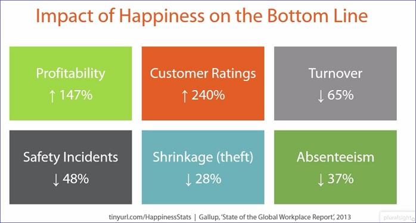

<html>
<head>
<h1 class="darkorange">Why Happiness in the Workplace Matters</h1>
<h3>https://app.pluralsight.com/library/courses/boost-productivity-employee-happiness</h3>
</head>
<body>
    

        

            

            <h3 class="green">Productivity</h3>
                
Productivity = Engagement and <strong class="darkorange">happiness</strong>
                
<u>Unhappy Employees:</u>

                <ul>
                    <li>Monopolize Manager's Time</li>
                    <li>Have more accidents</li>
                    <li>Produce more defects</li>
                    <li>Contribute to "shrinkage" or theft</li>
                    <li>Miss more days of work due to illness and other reasons</li>
                    <li>Quit at a higher rate</li>
                </ul>
                
Whatever the happy / engaged employees do; the unhappy / disengaged employees try to undo or undermine

                
            

            

            <h3 class="green">Unhappiness</h3>
                <ol>
                    <li class="darkorange">Boss</li>
                    <ul>
                        <li class="nobullet">"75% of people don't quit their jobs; they quit their bosses" - Roger Herman</li>
                    </ul>
                    <li class="darkorange">Company Culture</li>
                    <ul>
                        <li class="nobullet">"Culture must resonate" - Kylie Hunt</li>
                    </ul>
                    <li class="darkorange">Motivation</li>
                    <ul>
                        <li>"The deepest principle of Human Nature is the craving to be appreciated" - William James</li>
                        <li>"Knowing that our work helps others may increase our unconscious motivation" - Dan Ariely</li>
                    </ul>
                    <li class="darkorange">Purpose</li>
                    <ul>
                        <li class="nobullet">"We can expect that purpose, more than profitability, growth, or market share, will be the guiding principle for organizational decision-making" 
                        - Frederic Laloux, Reinventing Organizations</li>
                    </ul>
                </ol>
            

            

            <h3 class="green">Signs of an Unhappy Workplace</h3>
            <ul>
                <li>Interaction: are people interacting or sitting at their desk all day</li>
                <li>High turnover of top performers</li>
                <li>Lack of communication</li>
                <li>Faith in the product</li>
                <li>Low participation / referal rates</li>
                <li>Lost productivity</li>
            </ul>
        

    

</body>
</html>