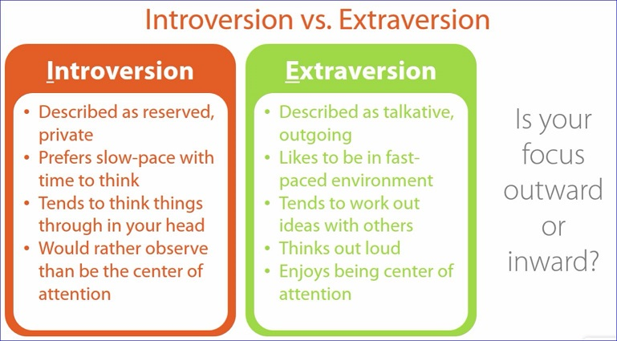

# Introversion vs. Extraversion

# Sensing vs. Intuition

# Feeling vs. Thinking

# Perceiving vs. Judging

# Reassessing with a New Perspective

Read through each slide and determine characteristic you more strongly associate with. There may be some you are equally associated with or some you associate with both **(S / N)** but one is primary and one is secondary **(S / n)**.  Write down the trait...     

