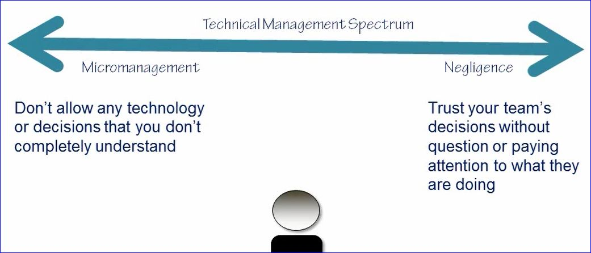
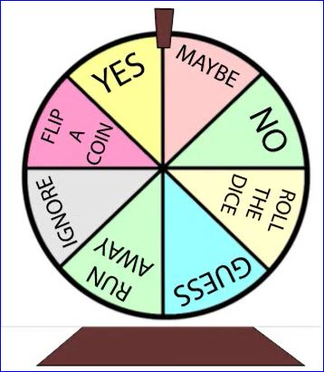

# Management

## You don't have to be a great leader to be a manager (but it doesn't  hurt)

### The Vision Thing

If everyone shares a common vision, everyone is more likely to make decisions that correspond to the vision

**Example 1**:
 We are a great development team, what we do is essential to the company. We deliver reliable code that is virtually bug free, and fix bugs fast.

**_Result_**:
 Slower development time, but lots of unit tests and diagnostics. Very stable and reliable code with rapid handling of problems that come up

**Example 2**:
 Our developers are the best of the best, we are the fastest development team around, and always strive to ship on schedule.

**_Result_**:
 Fast development, but may complromise on testing, documentation ad diagnostics. Code may ship, but may not be reliable

* Express the vision (in writing and verbally)
* The vision should express an outcome - it should help everyone figure out what to do when sigutations arise
* Internal feedback should support the vision

### Backing Up Your Team

* Monitor (don't micromange) communication between your team and others
* It's not an easy place to be as you are responsible both to your team and the the company
* Backing up your team is one of the single most important things you should do as a manager

#### Our View of Managers

* We want good manager - we don't always get them
* We don't understand what managers do (at least not early in our careers)

## The Dilemma of Technical Management

* You will not be expert at all of the technologies used by your team

A responsible manager may ask the questions like the following when suggestions are proposed that they don't fully understand:

* Sounds Interesting
* Is it open source or proprietary?
* Is adoption increasing or declining?
* Is ther an active user community?
* How long is it taking for bugs to get fixed?
* Has it been used in similar applications with success?
* Are there licensing issues?
* How often are there releases?
* What is the track record of maintaining backward compatibility?

### Trust but verify

#### Technical management is not so much about finding the right answers, it's about asking the right questions

## Decisions

* Making decisions can be scary - **making decisions is part of the job**

### General Suggestions:

* It is better to ask forgiveness than ask permission
* Don't make decisions that don't need making - _not making a decision is a decision_
* If you delegate a decision, make it real
* Collect as much information and advice as you can - _you'll rarely have as much as you need or want_

## Other People's Problems

When people come to you with problem, the more you do to help them learn to solve problems, the less you'll need to deal with yourself

When people come to you for a decision, always ask for a recommendation

* You'll get more information and they may come up with solutions you won't think of
* They may realize that no decision is really needed
* If you do make a decision, it's more likely they'll understand your reasoning, having been forced to consider the issue in-depth

## Treat Individuals as Indeviduals

* Try to understand  individual goals and needs
    * To findout what they are, ask
    * Adjust the way you treat people based on indvividual characteristics
* Your primary job is <strong>not</strong> to help people grow
    * It's to utilize people's strengths efficiently to accomplish a task
    * Play to people's strengths
    * Combine strengths to compensate for weakness

### Helping People Grow

* Remember you can't fix people - help only when asked
* Offer opportunities for growth - but don't compromise (too much) on getting the job done
* People don't always know what they want - don't try to figure it out for them

## Managing Friends

* It can get complicated
* The business relationship can impact the personal one - especially if you were friends first
* Good communication will help
* When a friend leaves, wish them luck - they may hire you one day