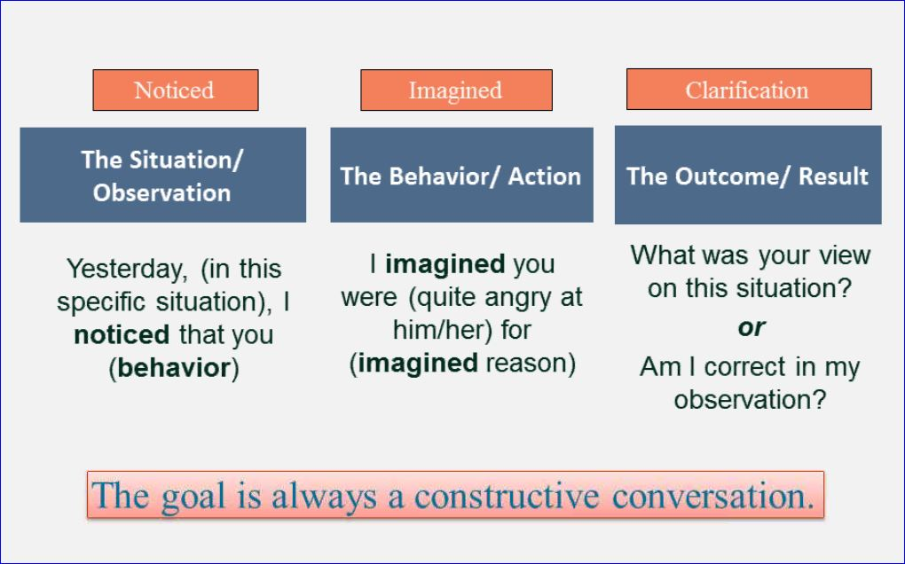

# Framing Conversations

Notice, Imagine, Clarification

Take "But" out of your conversations.  "But" instantly turns off the constructive part of the conversation.

## Example:
"I love you, but..." the person instantly thinks the worst.