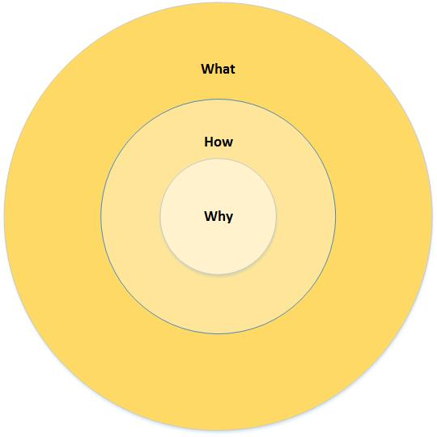

# How Great Leaders Inspire

## Tedx

### Simon Sinek

[How Great Leaders Inspire](https://www.youtube.com/watch?v=qp0HIF3SfI4)

The golden circle:

#### What, How, Why

* Everyone knows *what* they do
* Fewer know *how* they do it
* Even fewer know *why* they do it (these are the inspired leaders and organizations)

The best start with **Why** then **How** then **What**  

##### Example:

**Apple** - Bad (most people / companies) - UNINSPIRING

* We make great computers **what**
* They are beautifully designed, simple to use and user friendly **how**
* Wanna buy one?

**Apple** - Good (inspired people / companies) - INSPIRING (actual situation)

* Everything we do we believe in challenging the status quo, we believe in thinking differently **WHY**
* The way we challenge the status quo is by making our products beautifully designed, simple to use and user friendly **HOW**
* We just happen to make great computers; wanna buy one? **WHAT**

People don't buy **what** you do, they buy **why** you do it.  People are loyal to the **why** not the *what*